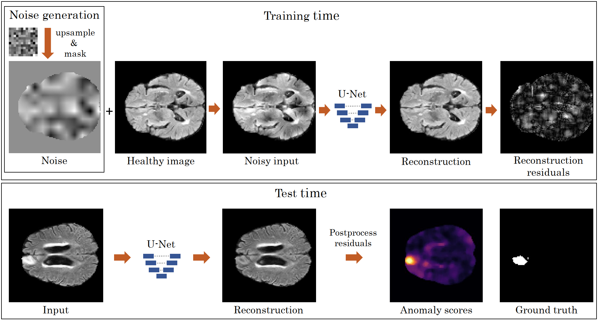

# Denoising Autoencoders for Unsupervised Anomaly Detection

## Introduction

This repository hosts the code that implements, trains and evaluates denoising autoencoders described in:

Kascenas, A., Pugeault, N. and O'Neil, A.Q., 2021. **Denoising Autoencoders for Unsupervised Anomaly Detection in Brain MRI.**
[https://openreview.net/forum?id=Bm8-t_ggzPD](https://openreview.net/forum?id=Bm8-t_ggzPD)

&nbsp;

Our denoising autoencoder anomaly detection method. During training (top), noise is added to the foreground of the healthy image, and the network is trained to reconstruct the original image.
At test time (bottom), the pixelwise post-processed reconstruction error is used as the anomaly score.
## Usage

'src/data_preprocessing.py' to process the BraTS2021 data. See [http://www.braintumorsegmentation.org/](http://www.braintumorsegmentation.org/) for requesting/downloading the data.

'src/denoising.py' to train a denoising autoencoder model.

'src/evaluate.py' to evaluate a trained model.

## Requirements
Dependency requirements can be found in 'environment.yml'

Use a conda environment to install the required libraries:
`$ conda env create -f environment.yml`